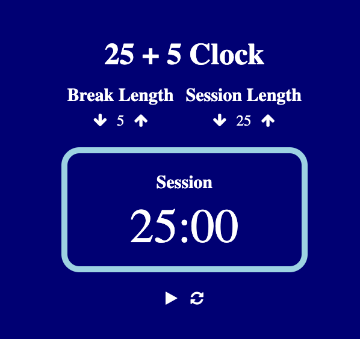

<h1 align="center">⏱ 25 + 5 Clock 🏆</h1>

  

<h2>
This project is a countdown clock that alternates between sessions and breaks.
</h2>

## 💻 Project

It is possible to click the arrow buttons to increase or decrease break or session lengths in minutes.
By clicking play, the clock will start to countdown until session time is over. After reaching 0, the break timer will stat to count down. 
The clock will continue to alternate until it is paused.
By click the reset button, all values will be reset to default.

## 🚀 Technologies

This project was developed using the following technologies:

- HTML
- JavaScript
- TypeScript
- React
- Redux
- SASS
- Git e Github

## 🔖 How to access it

- Download the zip file, download the modules needed with <code>npm install</code>, run <code>npm run dev</code> on the terminal and access localhost on a browser.
- [Click here to see it online](https://25-5-clock-nine.vercel.app/)
